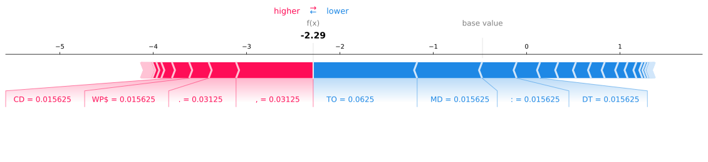
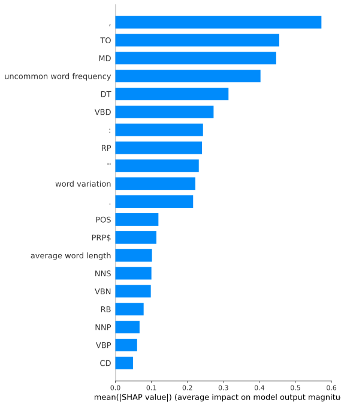

# shap-authorship-analysis-demo

SHAPによる著者分析のデモ用リポジトリ  
文章の特徴を分析し、著者の文章にどのような特徴がみられるのかプロットするデモアプリケーションです。

## デモ

[著者分析デモ](demo/nltk_gutenberg_analysis.ipynb)

### Force plot

### Decision plot

### Summary plot (bar)

### Summary plot

