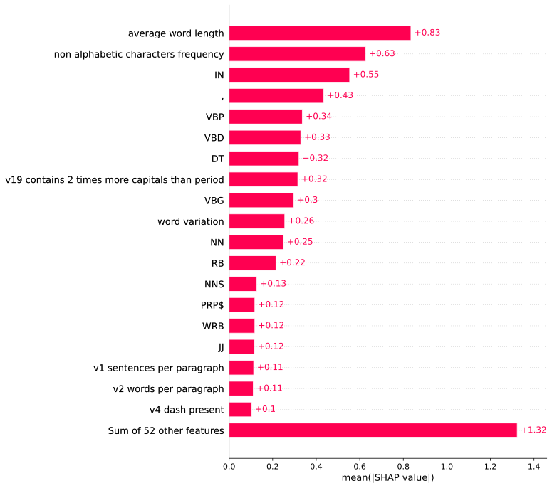
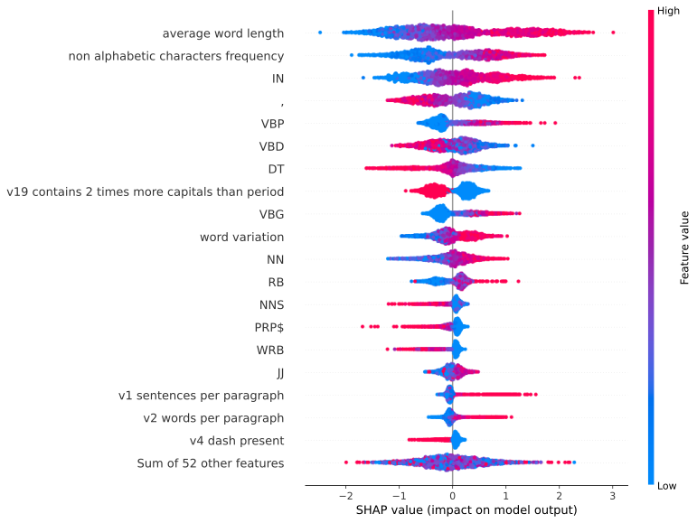

# shap-authorship-analysis-demo

SHAPによる著者分析のデモ用リポジトリ
文章の特徴を分析し、著者の文章にどのような特徴がみられるのかプロットするデモアプリケーション

## デモ (Project Gutenberg)

[著者分析デモ (Jupyter Notebook)](demo/data_classifier/nltk_gutenberg_analysis_demo.ipynb)

NLTKで利用可能なGutenberg Corpus ([https://www.gutenberg.org/](https://www.gutenberg.org/)) のうち、Chesterton氏とBryant氏の小説を著者ごとに分類。それぞれTrue・Falseでラベル付けを行いデータセットとして利用した。

データセットを作成するにあたり、各著者の小説全体に対して1段落を1つのデータポイントとみなし、LightGBMで学習・予測を行った。

予測に用いた特徴量には約30個の文法的特徴と約40個の品詞に対する段落中出現頻度を合計した計73種類の数値が用いられた。

LightGBMはブラックボックス化した機械学習モデルであるため、モデルの分類基準を説明するためにSHAP ([https://shap.readthedocs.io/en/latest/index.html](https://shap.readthedocs.io/en/latest/index.html))を導入した。

### Dataset details

- 記述スタイル: 小説 (1900年代初頭)
- クロスバリデーション手法: 100-fold cross validation
- データセット: Project Gutenberg Selections [source](https://www.nltk.org/nltk_data/#:~:text=Project%20Gutenberg%20Selections%20%5B%20download%20%7C%20source%20%5D) (Chesterton氏とBryant氏の小説を選択。これは両者の記述スタイルが類似しているため。)

- 以下に著者とその段落数を示す。
  | Author     | Paragraphs |
  | ---------- | ---------: |
  | Chesterton |       4055 |
  | Bryant     |       1194 |
  | Total      |       5249 |

  - （メモ：データポイント数に偏りがあるため、次のステップとして各著者から1000のデータポイントをランダムに選出する実装を追加する）

### Confusion matrix (100-fold cross validated model)

| Prediction | Bryant | Chesterton |
| ---------- | -----: | ---------: |
| Actual     |        |            |
| Bryant     |    612 |        582 |
| Chesterton |    202 |       3853 |

- (メモ：データポイント数の偏りのため、やや当てずっぽうにChesterton氏と予測する傾向が見られる。)

### Scores (100-fold cross validated model)

| Metrics  | Score |
| -------- | ----: |
| F1       | 0.907 |
| ROC-AUC  | 0.870 |
| Accuracy | 0.850 |

### Force plot

1番目のデータポイントに対する予測とその根拠をあらわすプロット  
SHAP値が大きい場合にChesterton氏、小さい場合にBryant氏であるとモデルが予測する傾向があることを示す。  
（1番目のデータポイントについては正答がChesterton氏であり、モデルも正しく予測していた）

### Decision plot

1番目のデータポイントに対するForce plotを、各特徴量ごとに行で分解して表示したもの。  
SHAP値が大きい場合にChesterton氏、小さい場合にBryant氏であるとモデルが予測する傾向があることを示す。  
（1番目のデータポイントについては正答がChesterton氏であり、モデルも正しく予測していた）

### Summary plot (bar)

100-fold クロスバリデーションにおける、各特徴量の分類への総合的な貢献度を表示したもの  

### Summary plot

100-fold クロスバリデーションによる各特徴量の強さ・弱さが、それぞれのデータポイントの分類に対してどのような貢献をしたのかを表示するプロット。  
SHAP値が大きい場合にChesterton氏、小さい場合にBryant氏であるとモデルが予測する傾向があることを示す。  

